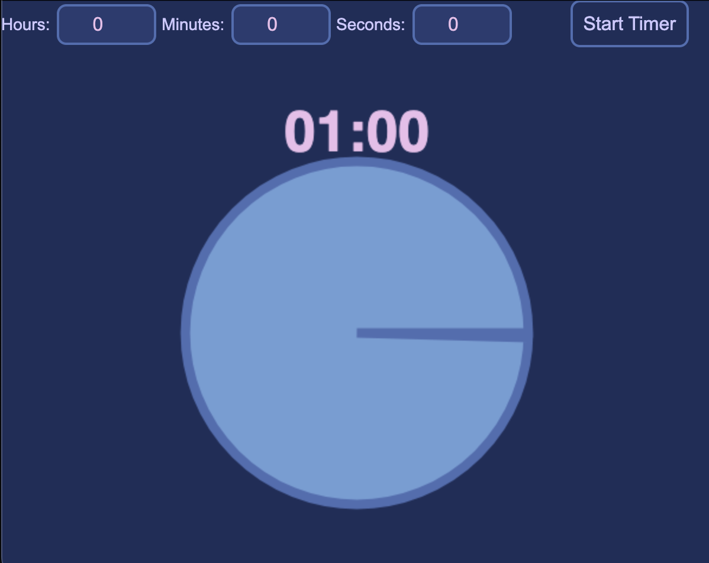

A simple visual timer application built with JavaScript and [Electron](https://www.electronjs.org/). The window is designed to always be visible so you can keep track of time while working on other tasks. 

<p align="center">
    
</p>

### Features
- **Stays visible** over other desktop applications.
- Timer **automatically scales** relative to window size.
- **Visual countdown** represented as a pie-slice animation, closing in as the remaining time goes down.

### Getting Started
Ensure you have [Node.js](https://nodejs.org/) installed on your machine. 

```bash
npm start
```
