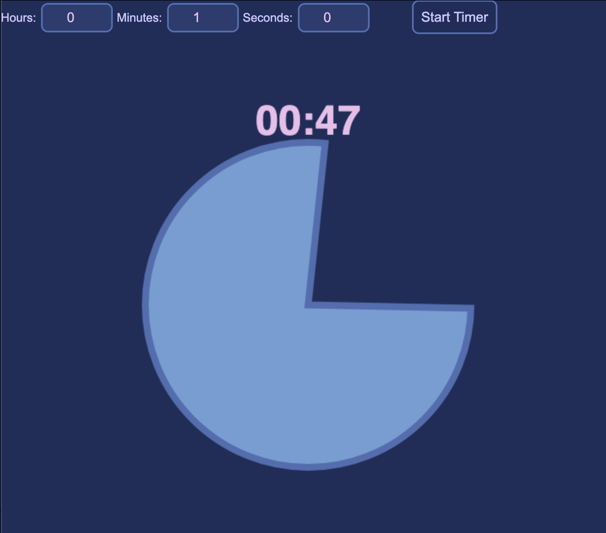

A simple, always on top, visual timer built with JavaScript and Electron. Designed to help you keep track of time passively while working, making it ideal as a Pomodoro timer or as a tool to combat time blindness. 

<p align="center">
    
</p>

<p align="center">
    
</p>

### Features
- **Stays visible** over other desktop applications.
- Timer **automatically scales** relative to window size.
- **Visual countdown** represented as a pie-slice animation that slowly closes as time ticks down.

### Getting Started
**Option 1: Standalone Application** 
<br>You can run the Visual Timer app directly on your device without downloading any extra software or dependencies. In standalone mode, the timer operates as a standard desktop window.

**Option 2: Always Visible** 
<br>To enable the always visible feature so the timer stays pinned over your active windows, you will need to install [Node.js](https://nodejs.org/).

```bash
npm install
npm start
```
